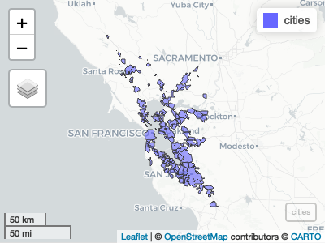
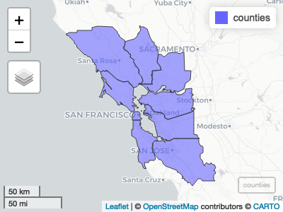
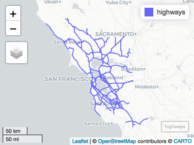
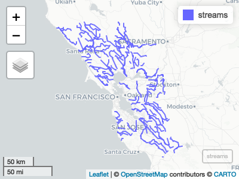
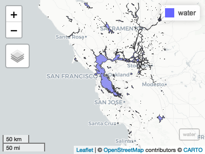
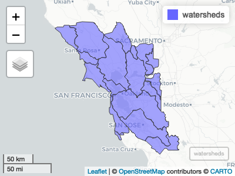
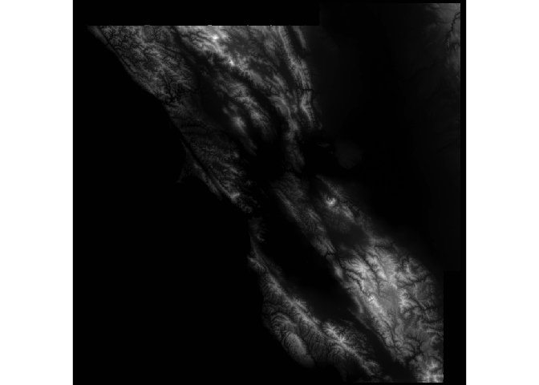

<!-- README.md is generated from README.Rmd. Please edit that file -->

# bayareamapping

<!-- badges: start -->

<!-- badges: end -->

bayareamapping is a collection of commonly used vector and raster data
germane to the San Franciso Bay Area.

## Installation

You can install the released version of bayareamapping from GitHub:

``` r
remotes::install_github("ir-sfsu/bayareamapping")
```

## Cities

``` r
library(bayareamapping)
library(mapview)
mapview(cities)
```



## Counties

``` r
mapview(counties)
```



## Highways

``` r
mapview(highways)
```



## Streams

``` r
mapview(streams)
```



## Water

``` r
mapview(water)
```



## Watersheds

``` r
mapview(watersheds)
```



## DEM

``` r
library(raster)
dem <- system.file("extdata/tif/dem90m.tif", package = "bayareamapping")
plot(raster(dem))
```


